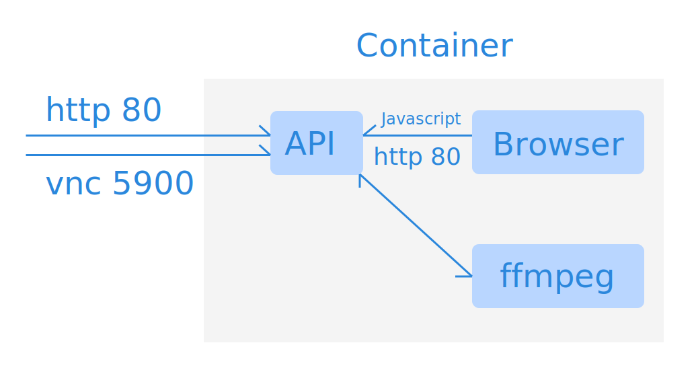

# Wind Recorder

## 什么是 Wind Recorder

 


[WindMark.pro] 是一个用 [Tailwind CSS](https://tailwindcss.com/) 框架和 [Markdown](https://en.wikipedia.org/wiki/Markdown) 进行视频制作的免费在线工具。

其原理是用 Web 技术制作自动播放的网页，在通过浏览器进行访问时，将其录制为视频。

而 [Wind Recorder] 正是 [WindMark.pro] 用于录制的开源项目，它不但可以用来录制 [WindMark.pro] 生成的网页，也可以录制任何可以在浏览器中正常播放的网页。

通过 [Wind Recorder] 只需要运行一行 Docker 命令即可完成视频录制。

```docker
docker run --rm -p 5900:5900 -p 80:80 -v "$(pwd):/data" easychen/windrec:latest  https://video.windmark.pro
```

将以上命令中的 `https://video.windmark.pro` 替换为要录制的自动播放网页URL即可。

录制效果可以查看这个视频 → [WindMark.pro使用教学](https://www.bilibili.com/video/BV1sb4y167Mh/)


## Wind Recorder 的工作原理



[Wind Recorder] 在容器中安装了浏览器，并启动了一个 Web 服务。当访问 `/start` 时，开始通过 ffmpeg 进行录制；当访问 `/stop` 时，停止录制。

除了在容器外通过 `http` 主动访问容器的 `/start` 和 `/stop`进行控制， 在容器内被录制的网页也可以通过 `JavaScript` 调用 `http://localhost/start` 和 `http://localhost/stop` 对录制进行控制。

## VNC 

虽然有了简单的控制接口，但在录制时，容器对我们依然是黑箱。因此 [Wind Recorder] 内置了 VNC 服务。当容器启动后，可以通过 VNC Viewer 等工具连接 5900 端口查看内部浏览器的画面，这在进行兼容性调试时非常有用。

## 中文支持

[Wind Recorder] 在容器环境中安装了中文字体，可以在要录制的网页中使用。


  字体中文名     |   字体英文名   |   Ubuntu  包名
| --- | --- |--- |
文泉驿微米黑   |         WenQuanYi Micro Hei         |   ttf-wqy-microhei
文泉驿正黑   |         WenQuanYi Zen Hei         |      ttf-wqy-zenhei         
文泉驿点阵宋体   |         WenQuanYi Bitmap Song |    xfonts-wqy

## FAQ

### 为什么录制的视频会卡顿？

请保持运行 docker 命令的机器网络良好，容器拥有至少 4G 的内存，页面越复杂，所需内存越多。

### 为什么音频视频不同步？

当内存不够时会出现这类问题，如果遇到请调大容器的内存。

另外因为录制时以追加方式写入mp4，如果遇到轻微的不同步，可以通过 [HandBrake](https://handbrake.fr/) 等工具对视频再次进行压缩和优化校正。

## Thanks

本项目录制部分的代码大量参考了[highattendance-aws-meeting-recording](https://github.com/banzai-io/highattendance-aws-meeting-recording)，并采用 Apache2.0 协议发布。

[WindMark.pro]: https://windmark.pro
[Wind Recorder]: https://github.com/easychen/windrecorder